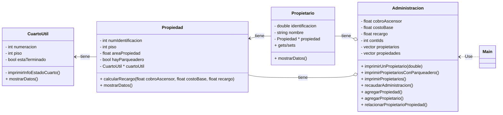

## Torres de Niza - solución completa

Ejercicio Codificación de clases, atributos y métodos.
Instanciación de objetos.

## Objetivos

- Configurar y utilizar un entorno de desarrollo integrado (IDE) para compilar y ejecutar el proyecto
- Analizar y comprender la estructura del código fuente proporcionado
- Implementar clases y sus relaciones en un lenguaje de programación orientado a objetos

> **Asignación**: Lea el siguiente enunciado e identifique en este orden: clases, atributos y métodos que abstrae el enunciado, luego explore el código fuente y realice cada punto que se indica

**Descripción**

El administrador del conjunto bosques de Niza desea contratar un software para la gestión de cobros y descuentos a
propietarios de la unidad.

Todo propietario tiene nombre, identificación y una única propiedad. Cada propiedad tiene un número de piso, un número
de identificación, un área. Algunas propiedades tienen parqueadero y otras no.

Para cada propiedad el propietario debe pagar la administración teniendo en cuenta lo siguiente:

- _Cobro por ascensor_. Vale 15000 pesos que se multiplican por el piso en el que se encuentre el apartamento.

- _El valor base_. Cada apartamento paga 150 mil pesos mensuales. La tarifa podría cambiar cada año.

- _Área_. Hay un recargo del 5 por ciento sobre el valor base para los apartamentos de más de 150mts

La administración quiere:

- Conocer el valor recaudado por administración para todo el edificio.
- Imprimir para cada propietario su información nombre, identificación y piso del apartamento de su propiedad
- Imprimir la lista de propietarios de propiedades que tienen parqueadero
- Imprimir la información de un propietario dado su id
- Agregar nuevas propiedades
- Agregar nuevos propietarios
- Asociar propietarios y propiedades

Existen propiedades que tienen cuarto útil. Este es un espacio de 2x3mts que los apartamentos usan como bodega. A la fecha en el conjunto existen dos tipos de cuarto útil, los que están terminados y los que se encuentran en obra gris. En articular, cuando el curto útil está en obra gris esto quiere decir que los propietarios no han terminado de hacer los arreglos posibles para ese espacio. En ese caso la administración ha decidido hacer un descuento del 1% del valor a pagar en administración para favorecer que los propietarios finalicen la construcción de sus cuartos útiles. Se espera que en el futuro todos los cuartos útiles estén totalmente terminados. Cada cuarto útil tiene una numeración y el número de piso en el que se encuentra.
Además de los reportes pedidos en la primera parte de este trabajo, el administrador ahora quiere saber:

- El nombre de los propietarios cuyas propiedades no tienen cuarto útil
- El nombre de los propietarios cuyas propiedades si tienen cuarto útil y están terminadas.
- El número de los apartamentos que si tienen cuarto útil pero no están terminados.

A la fecha Torres de Niza tiene los siguientes propietarios:

- Debora Vilar. CC 20202492 – Apto 101 – 160mts2 Piso 10 - Parqueadero – Si – Cuarto útil no terminado en el piso 2. Numeración A201
- Ignacio Rodríguez CC 30458 452 – Apto 901 – 30mts2 Piso 9 – Parqueadero – No - Cuarto útil terminado en el piso 2. Numeración A202
- Erika Muñoz CC 1058845781 – Apto 701 – 45mts Piso 7 - Parqueadero – Si - Cuarto útil terminado en el piso 2. Numeración A203
- Modesto Villaverde CC 31 321 432 - Apto 502 – 60 mts Piso 5 - Parqueadero – No – No tiene cuarto útil.

# Exploración de Visual Studio Code

- Agregue la extensión C++
- Agregue la extensión de Markdown
- Instale Cmake en su PC y haga la configuración
- Instale Make en su PC ( si no es linux o Mac) y haga la configuración
- Abra y observe los archivos `CMakePresets.json` y `CMakeLists.txt`

- Navegue por el código fuente del proyecto
- Configure el CMake y compile el proyecto. Aquí puede encontrar un video que explica cómo hacerlo: https://code.visualstudio.com/docs/cpp/CMake-linux. Note que el proyecto ya tiene el `CMakeList` y el `CmakePresets.json`

# Exploración en CLION

1. **Clonar el repositorio**:
   - Abre una terminal y clona el repositorio con el siguiente comando:&#8203;:contentReference[oaicite:2]{index=2}
     ```bash
     git clone https://github.com/lufe089/clases_objetos_relaciones_ejemplo.git

2. **Abrir el proyecto en CLion**:
* En CLion, selecciona "Abrir" en la pantalla de bienvenida o en el menú "Archivo".​
* Navega hasta la carpeta del proyecto clonado y selecciona el archivo CMakeLists.txt.​
* Haz clic en "Abrir" y luego en "Abrir como Proyecto".

3. **Configurar y compilar el proyecto**
* CLion configurará automáticamente el proyecto utilizando CMake. Espera a que finalice la configuración.
* Si es necesario, selecciona la configuración de compilación en la esquina superior derecha de la ventana (usualmente "Debug" o "Release").
* Haz clic en el botón "Build" para compilar el proyecto.

# Exploración de la implementación del código fuente

- Intente elaborar un diagrama UML que solucione el enunciado. Luego revise el archivo UML que soluciona el enunciado.
- Observe las clases del código fuente
- Observe la separación entre los archivos .cpp y .h. ¿Qué tienen en común y qué tienen de diferente?
- Identifique los métodos privados y públicos
- Observe que el .gitignore tiene ignoradas carpetas como buid y .vscode, ¿por qué se ignoran estas carpetas?
- Revise en el Main los métodos que muestran el menu
- Revise cómo se calcula el recaudo total
- Observe los constructores y destructores de las clases. ¿Cuáles clases tienen destructores? ¿Por qué?
- Identificar cómo se inicializan y utilizan las instancias de las clases Propietario, Propiedad, CuartoUtil, y Administracion.
- Revise el método inicializarDatos de la clase Administracion. ¿Qué hace este método?

## Nueva funcionalidad

- Mejore el código fuente para cambiar el estado de un cuarto útil a `terminado` para propiedades que tenían cuarto útil sin terminar

## UML
<details>
<summary>🔍 Diagrama propuesto</summary>

**Diagrama UML**

</details>
